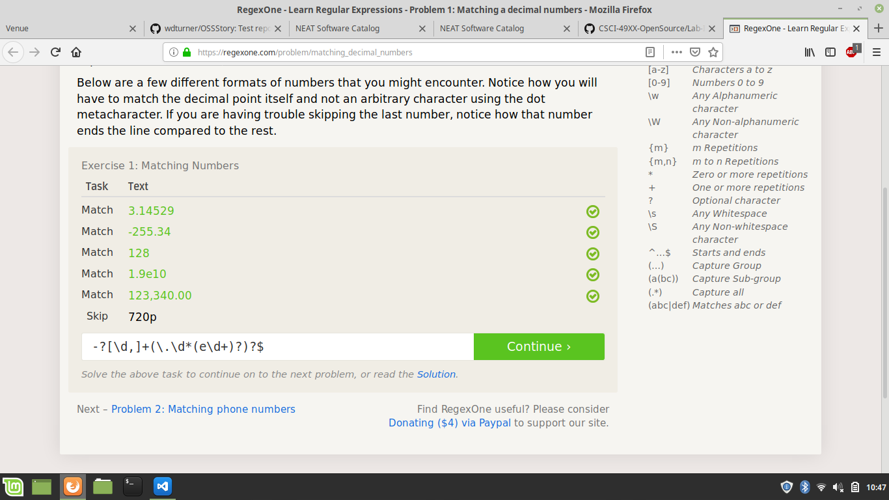

# Lab 01 Report - Introduction to Open Source Software
## Reading Assignments

### Smart Questions
I have a couple of additional tips:
* *Tact is important*. If you actually want to help someone solve a problem, rudeness is only going to make it more difficult for them.
* *Make sure you understand exactly what they're asking before starting to answer*. It's annoying when you start answering a question then realize you misunderstood it.

### Free Culture ch. 3
Reading stories like this makes me angry. The flagrant misuse of copyright is appalling. Jesse did not intentionally provide access to any copyrighted material; others on the network did that. He wasn't even trying to make a profit. It seems really unjust to me that someone can be attacked for working on projects in good faith. In addition, it is disheartening that organizations like the RIAA must know that some of the people they pursue have no ill intentions, yet go through with it anyway. That is why we need the open source movement. We need open source to become embedded in our culture.

## Tree

## Regex

## Snap/Blockly

# Reflection
It seems that the most interesting projects to evaluate would be projects that I regularly use. Looking through my command history, I think it would be interesting to evaluate git, jupyter, or pip. As for finding projects that interest me, I'm getting into reinforcement learning, specifically neuroevolution. I think doing something with [HyperNEAT](https://doi.org/10.1162/artl.2009.15.2.15202) could be interesting and useful, because there is a lack of well-designed libraries for it.