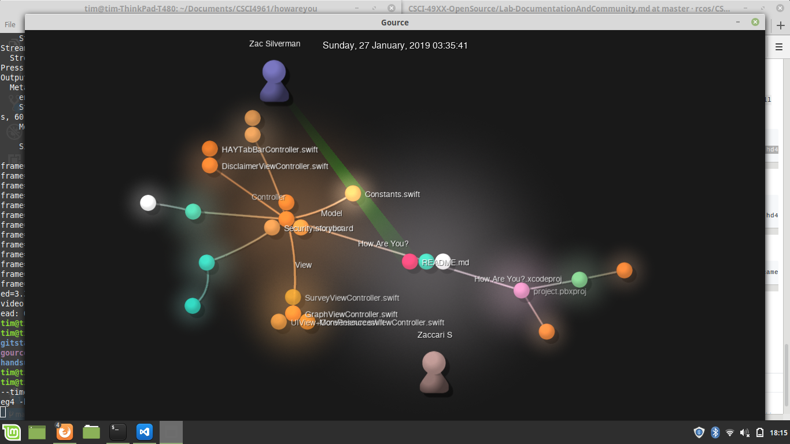

# Documentation

## 3. Square Roots

Using the following:

```latex
$$\sqrt{1 + 2\sqrt{1 + 3\sqrt{1 + 4\sqrt{1 + \ldots}}}}$$

$$\sqrt{2}^{\sqrt{2}^{\sqrt{2}^{\sqrt{2}\ldots}}}$$
```

## 4. Hadamard Matrix

```latex
$$
\begin{bmatrix}
  1 & 1 & 1 & 1\\
  -1 & 1 & -1 & 1\\
  -1 & -1 & 1 & 1\\
  1 & -1 & -1 & 1
\end{bmatrix}
$$
```

# Community

## Handsup
Number of contributors: 3

Lines of code: 2206 (excluding yarn.lock)

First commit: Apr 11, 2019 (1882160)

Latest commit: Apr 22, 2019 (0b0ce04)

Current branches:
* bootstrap
* master


## Hazel Heaters
Number of contributors: 2

Lines of code: 3368

First commit: Jan 25, 2019 (0fc393b)

Latest commit: Feb 10, 2019 (83a7f31)

Current branches:
* master


## Hedgehogs
Number of contributors: 16

Lines of Code: 22102 (excluding .csv, .json, .jpg, .pdf)

First commit: Jan 29, 2018 (34a38d4)

Latest commit: Apr 27, 2019 (07129fb)

Current branches:
* candleStick_data
* directory-fix
* feature/betaProvisionSchema
* feature/_old
* feature/provisionSchema
* feature/pytest
* feature/testsXlsxdownloader
* fix_xlsx2json
* jarodJsonFix
* master
* searchStock
* stockDataScraper
* xlsx_json_fix


## How are you?
Number of contributors: 2

Lines of code: 29709 (excluding .pbxproj)

First commit: Jan 15, 2019 (2f3ed28)

Latest commit: Apr 22, 2019 (86b32ba)

Current branches:
* master
* moreResources



## Impac
Number of contributors: 3

Lines of code: 45926

First commit: Mar 12, 2019 (bee21a6)

Latest commit: Apr 27, 2019 (af91574)

Current branches:
* allison
* ethan
* jing
* master
* monaco

