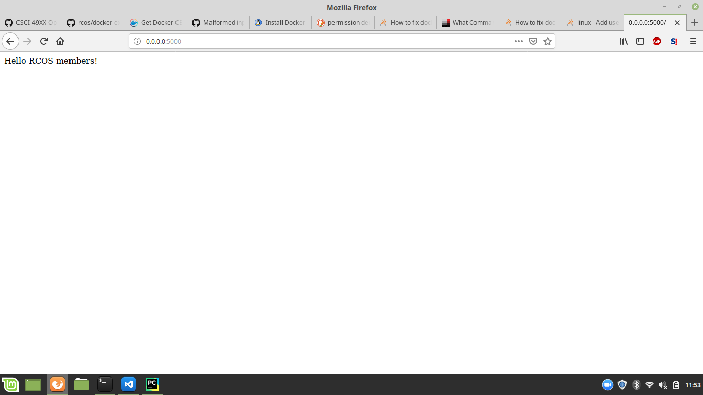
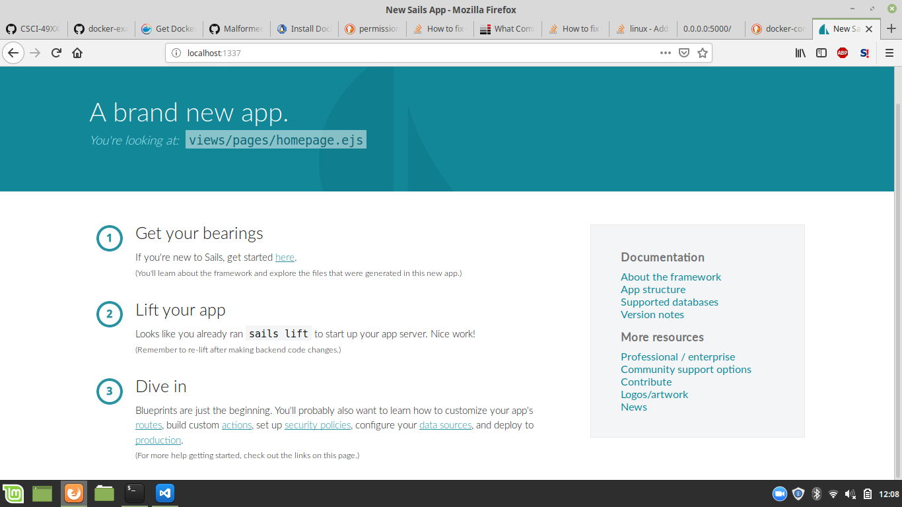
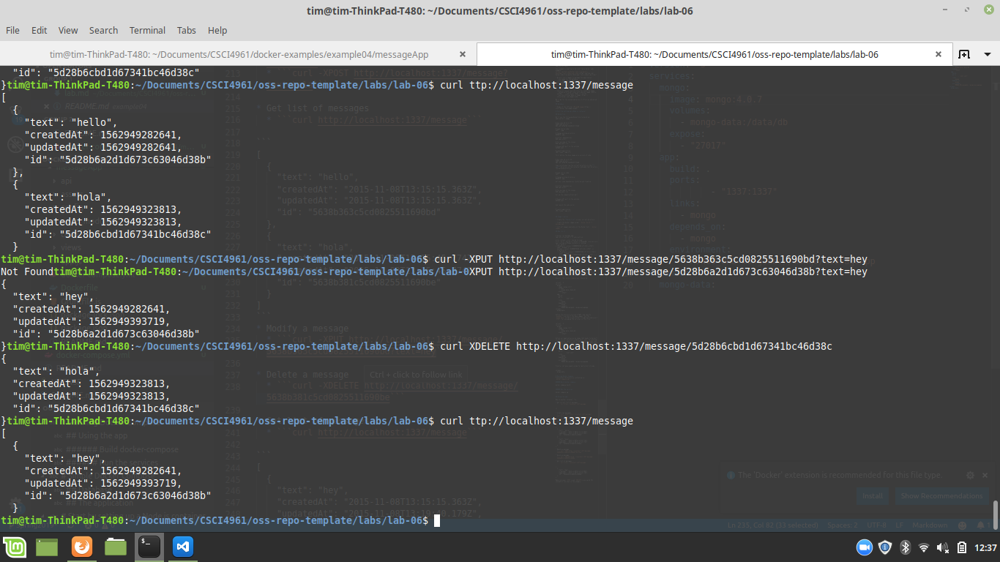

# Step 0
I had some trouble running `apt-get update` - I think it's because I'm running Linux Mint, so there isn't a release for my mint version "Tessa", but it is running on top of an ubuntu release. Instead of using `lsb_release -cs`, I used the command `. /etc/os-release; echo "$UBUNTU_CODENAME"`.

# Step 1
This step went off pretty much without a hitch; I did have to do `sudo docker run`, which is kind of non-ideal. I added myself to the docker group (`sudo usermod -aG docker tim`), but it wasn't reflecting when I listed the groups I am in. Then, I realized I needed to log back in, because changes don't take place until then.

# Step 2
This step didn't work... I was able to run the db and rocketchat containers, but I was unable to connect to `localhost:3000`.

# Step 3

# Step 4
This step was fine. All I had to do was make sure everything was inside the messageApp directory.

