```python
import tensorflow as tf
from tensorflow import keras
from PIL import Image
from PIL import ImageOps

import numpy as np
import matplotlib.pyplot as plt

print(tf.__version__)
plt.plot((-2, 4), (-6, 6))
plt.show()
```

    1.14.0


    <Figure size 640x480 with 1 Axes>


```python
fashion_mnist= keras.datasets.fashion_mnist
(train_images, train_labels), (test_images, test_labels) = fashion_mnist.load_data()
```


```python
class_names = ['T-shirt/top', 'Trouser', 'Pullover', 'Dress', 'Coat',
               'Sandal', 'Shirt', 'Sneaker', 'Bag', 'Ankle boot']
```


```python
train_images.shape
```


    (60000, 28, 28)


```python
plt.figure()
plt.imshow(train_images[0])
plt.colorbar()
plt.grid(False)
plt.show()
```


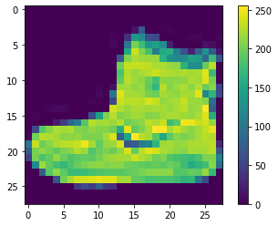


```python
train_images = train_images / 255.
test_images = test_images / 255.
```


```python
plt.figure(figsize=(10,10))
for i in range(25):
    plt.subplot(5,5,i+1)
    plt.xticks([])
    plt.yticks([])
    plt.grid(False)
    plt.imshow(train_images[i], cmap=plt.cm.binary)
    plt.xlabel(class_names[train_labels[i]])
plt.show()

```


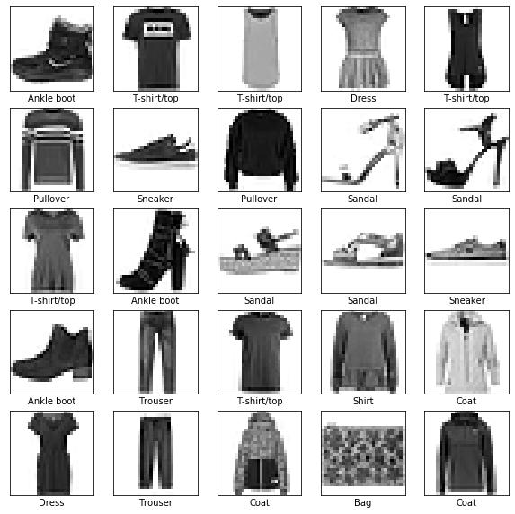


```python
model = keras.Sequential([
    keras.layers.Flatten(input_shape=(28, 28)),
    keras.layers.Dense(128, activation=tf.nn.relu),
    keras.layers.Dense(10, activation=tf.nn.softmax)
])
```

    WARNING: Logging before flag parsing goes to stderr.
    W0808 20:33:54.454534 140529768666944 deprecation.py:506] From /home/tim/miniconda3/envs/env2/lib/python3.7/site-packages/tensorflow/python/ops/init_ops.py:1251: calling VarianceScaling.__init__ (from tensorflow.python.ops.init_ops) with dtype is deprecated and will be removed in a future version.
    Instructions for updating:
    Call initializer instance with the dtype argument instead of passing it to the constructor


```python
model.compile(optimizer='adam',
              loss='sparse_categorical_crossentropy',
              metrics=['accuracy'])

```


```python
model.fit(train_images, train_labels, epochs=5)
```

    Epoch 1/5
    60000/60000 [==============================] - 3s 50us/sample - loss: 0.4936 - acc: 0.8249
    Epoch 2/5
    60000/60000 [==============================] - 3s 48us/sample - loss: 0.3740 - acc: 0.8651
    Epoch 3/5
    60000/60000 [==============================] - 3s 47us/sample - loss: 0.3334 - acc: 0.8783
    Epoch 4/5
    60000/60000 [==============================] - 3s 47us/sample - loss: 0.3104 - acc: 0.8861
    Epoch 5/5
    60000/60000 [==============================] - 3s 48us/sample - loss: 0.2942 - acc: 0.8914


    <tensorflow.python.keras.callbacks.History at 0x7fcf54e79a58>


```python
test_loss, test_acc = model.evaluate(test_images, test_labels)
print('Test accuracy:', test_acc)
```

    10000/10000 [==============================] - 0s 29us/sample - loss: 0.3495 - acc: 0.8734
    Test accuracy: 0.8734


```python
predictions = model.predict(test_images)
```


```python
predictions[0]
```


    array([2.44390649e-05, 1.05128841e-07, 1.18957878e-07, 2.07152880e-07,
           1.17075416e-07, 5.09300688e-03, 1.03942159e-06, 2.72343587e-02,
           2.13760109e-06, 9.67644513e-01], dtype=float32)


```python
np.argmax(predictions[0])
```


    9


```python
test_labels[0]
```


    9


```python
def plot_image(i, predictions_array, true_label, img):
  predictions_array, true_label, img = predictions_array[i], true_label[i], img[i]
  plt.grid(False)
  plt.xticks([])
  plt.yticks([])
  
  plt.imshow(img, cmap=plt.cm.binary)
  
  predicted_label = np.argmax(predictions_array)
  if predicted_label == true_label:
    color = 'blue'
  else:
    color = 'red'
  
  plt.xlabel("{} {:2.0f}% ({})".format(class_names[predicted_label],
                                100*np.max(predictions_array),
                                class_names[true_label]),
                                color=color)

def plot_value_array(i, predictions_array, true_label):
  predictions_array, true_label = predictions_array[i], true_label[i]
  plt.grid(False)
  plt.xticks([])
  plt.yticks([])
  thisplot = plt.bar(range(10), predictions_array, color="#777777")
  plt.ylim([0, 1])
  predicted_label = np.argmax(predictions_array)
  
  thisplot[predicted_label].set_color('red')
  thisplot[true_label].set_color('blue')

```


```python
# Plot the first X test images, their predicted label, and the true label
# Color correct predictions in blue, incorrect predictions in red
num_rows = 5
num_cols = 3
num_images = num_rows*num_cols
plt.figure(figsize=(2*2*num_cols, 2*num_rows))
for i in range(num_images):
  plt.subplot(num_rows, 2*num_cols, 2*i+1)
  plot_image(9000 + i, predictions, test_labels, test_images)
  plt.subplot(num_rows, 2*num_cols, 2*i+2)
  plot_value_array(9000 + i, predictions, test_labels)
plt.show()
```


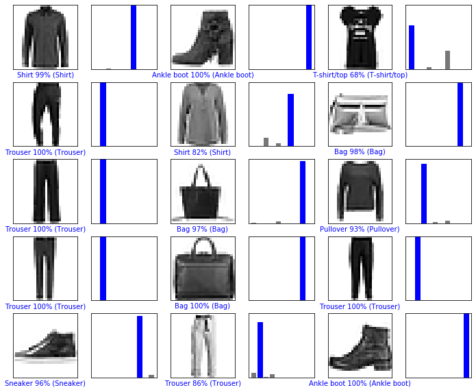


```python
im_boot_orig = Image.open("./boot.jpeg")
im_pullover_orig = Image.open("./pullover.jpg")
im_shirt_orig = Image.open("./buttondown.jpg")
```


```python
im_pullover = im_pullover_orig.crop(box=(100, 500, 1200, 1600))
plt.imshow(im_pullover)
```


    <matplotlib.image.AxesImage at 0x7fcf381c0080>


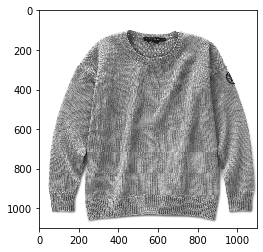


```python
old_size_boot = im_boot_orig.size
new_size_boot = (1500, 1500)
new_im_boot = Image.new("RGB", new_size_boot, color=(255,255,255))
new_im_boot.paste(im_boot_orig, ((new_size_boot[0] - old_size_boot[0])//2,
                       (new_size_boot[1] - old_size_boot[1])//2))
im_boot = new_im_boot
plt.imshow(im_boot)
```


    <matplotlib.image.AxesImage at 0x7fcf382febe0>


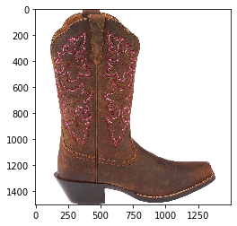


```python
old_size_shirt = im_shirt_orig.size
new_size_shirt = (445, 445)
new_im_shirt = Image.new("RGB", new_size_shirt, color=(255,255,255))
new_im_shirt.paste(im_shirt_orig, ((new_size_shirt[0] - old_size_shirt[0])//2,
                       (new_size_shirt[1] - old_size_shirt[1])//2))
im_shirt = new_im_shirt
plt.imshow(im_shirt)
```


    <matplotlib.image.AxesImage at 0x7fcf57f12a20>


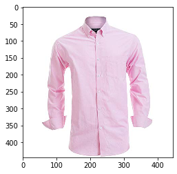


```python
pullover_preproc = \
np.array(
ImageOps.invert(
ImageOps.scale(
ImageOps.grayscale(im_pullover), 28 / 1100))) / 255.

plt.xticks([])
plt.yticks([])
plt.imshow(im_pullover)
plt.show()

plt.xticks([])
plt.yticks([])
plt.imshow(pullover_preproc)
plt.show()
```


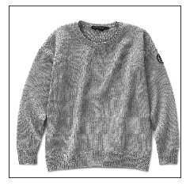


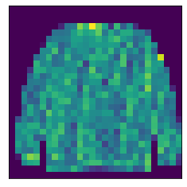


```python
boot_preproc = \
np.array(
ImageOps.invert(
ImageOps.scale(
ImageOps.grayscale(im_boot), 28 / 1500))) / 255.

plt.xticks([])
plt.yticks([])
plt.imshow(im_boot)
plt.show()

plt.xticks([])
plt.yticks([])
plt.imshow(boot_preproc)
plt.show()
```


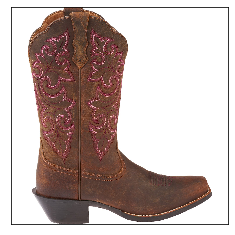


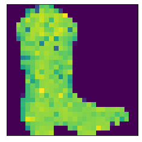


```python
shirt_preproc = \
np.array(
ImageOps.invert(
ImageOps.scale(
ImageOps.grayscale(im_shirt), 28 / 445))) / 255.

plt.xticks([])
plt.yticks([])
plt.imshow(im_shirt)
plt.show()

plt.xticks([])
plt.yticks([])
plt.imshow(shirt_preproc)
plt.show()
```


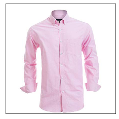


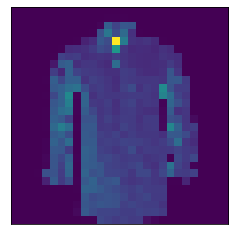


```python
images = [pullover_preproc, boot_preproc, shirt_preproc]
preds = model.predict(np.array(images))
```


```python
for im, pred in zip(images, preds):
    plt.imshow(im)
    plt.xticks([])
    plt.yticks([])
    
    probs = sorted(((class_names[i], x) for i, x in enumerate(pred)), key=lambda t: t[1], reverse=True)
    xlbl = ', '.join('{}, {:5.2f}%'.format(label, prob*100) for label, prob in (probs[:3]))
    #maxprob = np.max(pred)
    #maxix = np.argmax(pred)
    #maxlabel = [x for i, x in enumerate(class_names) if i == maxix][0]
    
    #plt.xlabel('{}, {:4.1f}%'.format(maxlabel, maxprob*100))
    plt.xlabel(xlbl)
    plt.show()
```


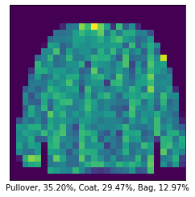


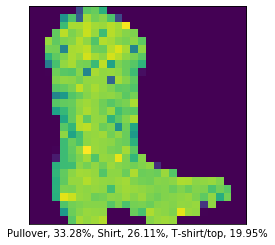


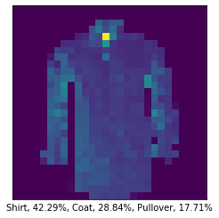


```python

```
